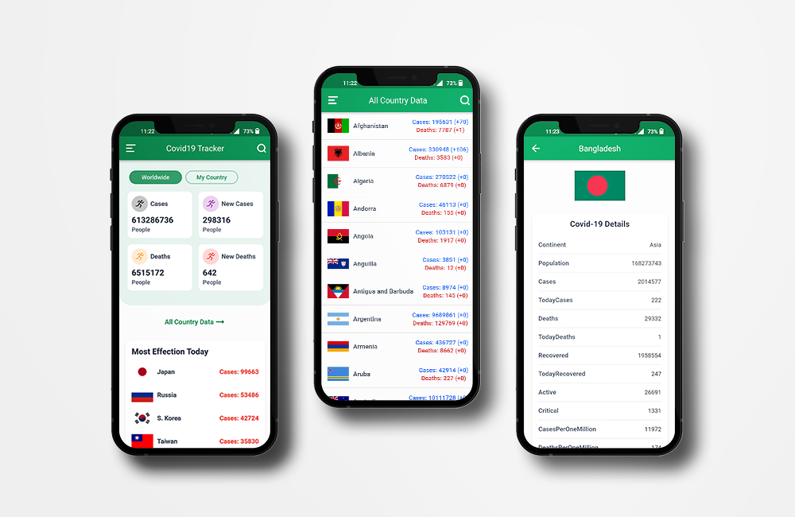
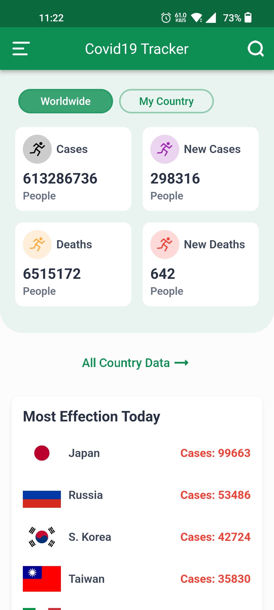
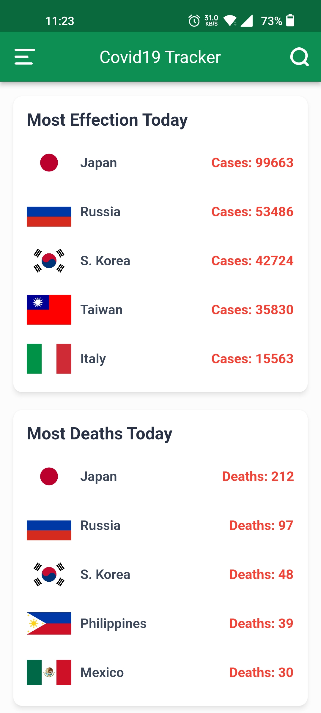
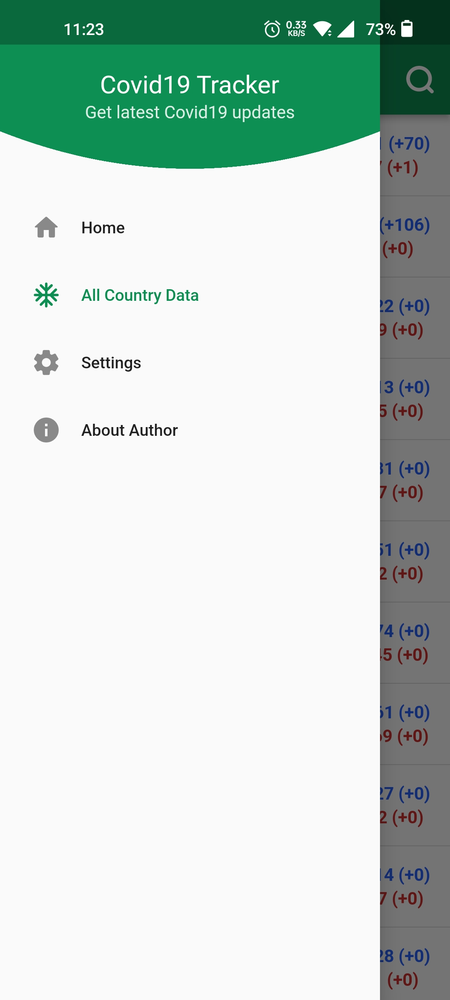
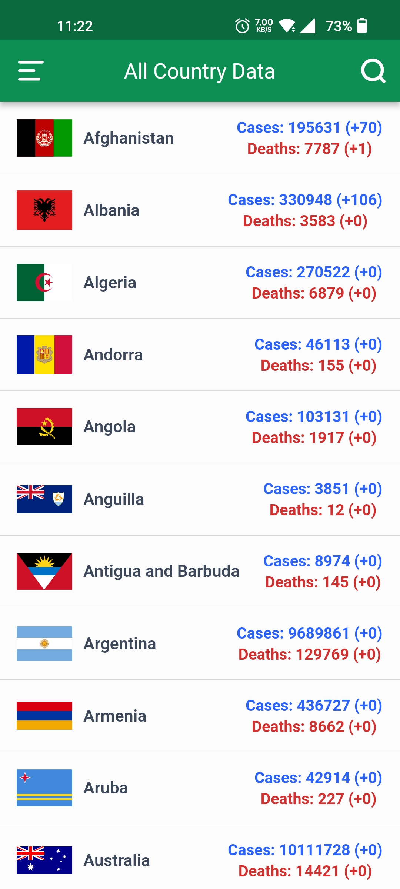
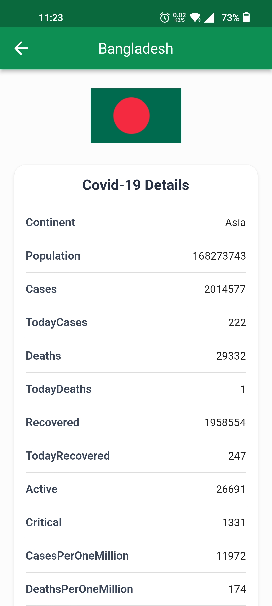

# Covid19 Tracker

Covid-19 Tracker mobile app for Android & IOS devices built with Dart & Flutter framework.

### Support this project

  

## Screenshots

  &nbsp;  &nbsp;  &nbsp; 
 
  &nbsp;  &nbsp;  &nbsp;